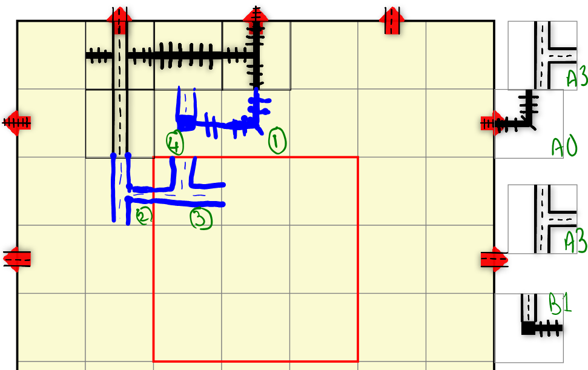
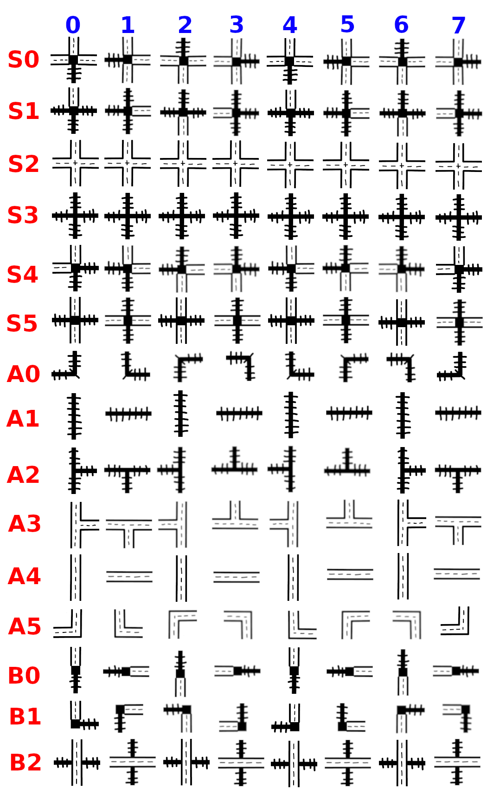
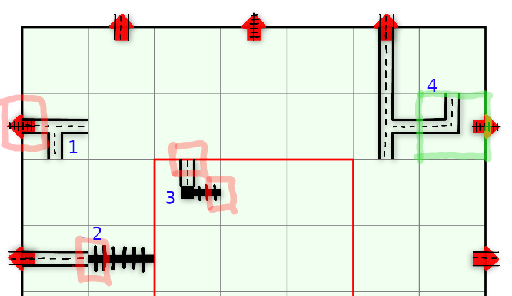
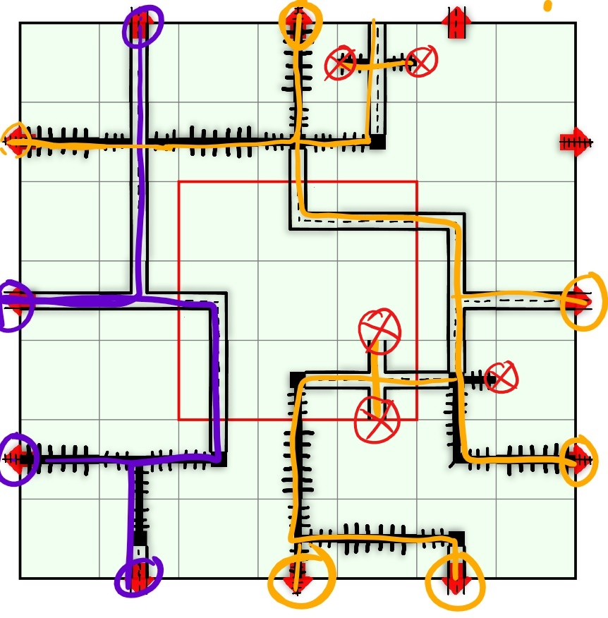
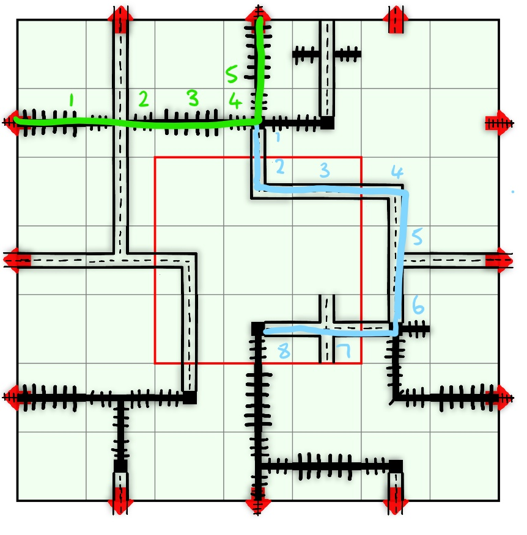

# COMP1110 Assignment 2

## Academic Honesty and Integrity

Honesty and integrity are of utmost importance.
These goals are *not* at odds with being resourceful and working collaboratively.
You *should* be resourceful, you should collaborate within your team, and you should discuss the assignment and other aspects of the course with others taking the class.
However, *you must never misrepresent the work of others as your own*.
If you have taken ideas from elsewhere or used code sourced from elsewhere, you must say so with *utmost clarity*.
At each stage of the assignment you will be asked to submit a statement of originality, either as a group or as individuals.
This statement is the place for you to declare which ideas or code contained in your submission were sourced from elsewhere.

Please read the ANU's [official position](http://academichonesty.anu.edu.au/) on academic honesty.
If you have any questions, please ask me.

Carefully review the statement of originality which you must complete for each stage of the assignment.
Edit that statement and update it, ensuring that when you complete each stage, a truthful statement is committed and pushed to your repo.

## Purpose

In this assignment you will exercise a number of major themes of the course, including software design and implementation,
using development tools such as Git and IntelliJ, using JavaFX to build a user interface.
As an extension task, you may also explore strategies for writing agents that play games.
Above all, this assignment will emphasize group work.

## Assignment Deliverables

The assignment is worth 25% of your total assessment, and it will be marked out of 25.
So each mark in the assignment corresponds to a mark in your final assessment for the course.
Note that for some stages of the assignment you will get a _group_ mark, and for others you will be _individually_ marked.
The mark breakdown and the due dates are described on the [deliverables](https://cs.anu.edu.au/courses/comp1110/assessments/deliverables/) page.

Your work will be marked via your tutor accessing Git, so it is essential that you carefully follow instructions for setting up and maintaining your group repository.
At each deadline you will be marked according to whatever is committed to your repository at the time of the deadline.
You will be assessed on how effectively you use Git as a development tool.

## Problem Description

Your task is to implement in Java, using JavaFX, a dice-and-pencils game called [*Railroad Ink: Deep Blue Edition*](https://www.horrible-games.com/railroad-ink-deep-blue-edition/),
made by games developer [Horrible Games](https://www.horrible-games.com/).
[Board Game Geek provides a description of Railroad Ink](https://boardgamegeek.com/boardgame/245654/railroad-ink-deep-blue-edition), including images of the components.

### Rules

Railroad Ink is a solo game, but can also be played as a competition by having multiple players compete using the same dice rolls.
The objective is to place Tiles representing Highway and Railway routes so as to create a network connecting as many Exits as possible.

The game is played over seven rounds. 
Each round, the four tile dice are rolled to determine the tiles that may be placed for that round.
When placing a tile, it may be flipped or rotated in any direction.
All four tiles *must* be placed, unless doing so would result in an illegal placement (see [Tiles](#tiles).
After placement is finished, the dice are re-rolled and the next round begins.

In addition to the regular tiles, each round the player may choose to place one of six special tiles, with a maximum of three special tiles per game.
The special tiles may also be flipped and rotated.

In competitive play, each player constructs their network independently using the same sequence of dice rolls, with their own private set of special tiles.

The game ends at the end of the 7th round, and scoring determines the winner.

In the below play-through: the dice rolled for the turn are "**B1A3A0A3**". 
**A0B30** is placed first, followed by **A3C10** and **A3C23**. **B1B20** is then placed last. 
**B1B20** is a valid (but perhaps poor) choice of placement. 
(See rules below for [Legal Placements](#legal-placements).)

The dice are then rolled again and a new round begins.

#### Board

The game board is a 7x7 grid with rows labelled A-G and Columns labelled 0-6.
Around the edge of the board are 12 exits, each with a corresponding type: Railway or Highway (r or h). 
The centre grid *(italicized)* has no impact on the tile placement, but is important for scoring at the end of the game.

| --- | --- | 0 | 1 | 2 | 3 | 4 | 5 | 6 | --- |
| --- | --- | ----- | ----- | ---- | ---- | ---- | ---- | ---- | ---- |
| --- | exit | - | h | - | r  | -  | h  | -  | exit |
| A | --- | A0 | A1 | A2 | A3 | A4 | A5 | A6 | --- |
| B |  r  | B0 | B1 | B2 | B3 | B4 | B5 | B6 | r |
| C | --- | C0 | C1 | *C2* | *C3* | *C4* | C5 | C6 | - |
| D |  h  | D0 | D1 | *D2* | *D3* | *D4* | D5 | D6 | h |
| E | --- | E0 | E1 | *E2* | *E3* | *E4* | E5 | E6 | - |
| F |  r  | F0 | F1 | F2 | F3 | F4 | F5 | F6 | r |
| G | --- | G0 | G1 | G2 | G3 | G4 | G5 | G6 | - |
| --- | exit | - | h | - | r  | -  | h  | -  | exit |

#### Tiles

*  There are two different types of dice used in this game. 
   One type of die (**A**) has six different faces and the other (**B**) has three different faces (i.e. each pair of opposing faces is identical).
*  Each round, die **A** will be rolled three times and die **B** will be rolled once.
*  There are six special tiles (denoted by **S0-5**) which do not appear on either die; each of these may be used at most once per game, with a maximum of three special tiles placed per game.
*  There are three different route types: *Highways* (**A3-5**), *Railways* (**A0-2**), and *Stations* (**B0-1**).
   Stations are denoted by a black box in the middle of the road.
   Some special tiles are also stations.
   Stations act as a connector between Highways and Railways. 
*  The *Overpass* (**B2**) is both a Highway and a Railway, but does *NOT* connect the two.
   It is represented by a Highway passing over a Railway, and it simply allows them to cross paths. 
*  Altogether there are 15 different tile types. 
*  Tiles may be rotated, or flipped across the x or y axis.
   Altogether there are eight orientations, although you'll notice that for some tiles, some of these orientations are equivalent.
*  Orientation 0 is the unrotated state. Orientations 1, 2, and 3 represent rotations of 90, 180, and 270 degrees clockwise, respectively.
   Orientation 4 is created by mirroring orientation 0 over the y-axis, and then 5 through to 7 are rotated 90-270 degrees clockwise from orientation 4.

#### Legal Placements

*  A tile must be placed such that at least one edge connects to either an exit or a pre-existing route.
   Such a connection is called a *valid* connection.
*  Tiles may not be placed such that a highway edge connects to a railway edge; this is referred to as an *invalid*
   connection.
   Highways and railways may only join at station tiles.
*  A tile may have one or more edges touching a blank edge of another tile; this is referred to as *disconnected*,
   but the placement is still legal.
*  Routes may not cross over, with the exception of the overpass tile.

In the image below;
*  **1** is illegal because a highway has an invalid connection to a railway exit.
*  **2** is illegal because a railway has an invalid connection to a highway.
*  **3** is illegal because there is no valid connection to either an exit or pre-existing route. 
*  **4** is legal because it has a valid connection to a pre-existing route,
   and is disconnected from the railway exit.

#### Encoding Game State

The game state is represented by a *board string* consisting of a number of *tile placement strings*.
Each tile placement is represented by a string of five characters:
*  The first character tells you which die (or special tiles) (**A, B or S**)
*  The second character tells you which tile on the die (**0-5**)
*  The third character tells you which row the tile is placed in (**A-G**)
*  The fourth character tells you which column the tile is placed in (**0-6**)
*  The fifth character tells you the orientation of the tile (**0-7**)

The special tiles are described similarly (even though they aren't on a die) with **S** for special, and **0-5** representing the tile.

For example: the tile placement string **B0A53** tells us that the tile on *die* **B** *face* **0** is placed at grid **A5** in *orientation* **3**,
whereas **S3G26** tells us *Special tile* **3** is placed at **G2** in *orientation* **6**.
The entire board string: "A4A12B2B16A1B01A1B23S1B32A1A32B1B44B2A44A4C16A3D15A4D01A5D23A4E20B1F24A2F17A1F01B0G16A5C34A4C43A5C53A3D50A4D61S4E50A0F51A1F67S2E46B1E31A1F30A2G36A1G41B1G52" encodes the game we used in the scoring example.

#### Scoring

*  Each player scores points based on how many exits each of their routes are connected to.

| Number of Exits connected to route | 2 | 3 | 4 | 5 | 6 | 7 | 8 | 9 | 10 | 11 | 12 |
| ------ | ------ |  ------ | ------ | ------ | ------ | ------ | ------ | ------ | ------ | ------ | ------ |
| Points Awarded | 4 | 8 | 12 | 16 | 20 | 24 | 28 | 32 | 36 | 40 | 45 |

*  Each player then loses one point for each 'Error'. 
Errors are the edges of routes that are not connected to an edge of the board.
Routes that end at the edge of the board (whether on an exit or not), or exits that are not connected to a route *DO NOT* count as errors.

*  Each player gets one point for each of the squares of their centre grid that are covered.
*  Each player counts their longest Highway and gets one bonus point per square the highway covers.
*  Likewise, each player counts their longest railway and gets one bonus point per square the railway covers.
*  If a player has multiple Railways (or Highways) of equal longest length, they only score bonus points for one.
*  In competitive play, the player with the most points wins. 
In the case of a tie, the person with the fewest errors on the board wins.

**For Example:**

For Basic Scoring: 
*  The purple route is connected to *4 exits* so we score *12 points*.
*  The orange route is connected to *6 exits* so we score *20 points*.
*  We have a tile in *6* squares of the *centre grid* so we score *6 points*.
*  We have *5 errors/unconnected edges* (shown as red crosses) so we *lose 5 points*.
*  So for our basic score we have 12 + 20 + 6 - 5 = 33 points.

For Bonus Scoring:
*  Our *longest highway* (blue) spans *8 tiles*, so we score *8 points*.
*  Our *longest railway* (green) spans *5 tiles*, so we score *5 points*.
*  In total, we scored 33 + 8 + 5 = 46 points.

## Legal and Ethical Issues

First, as with any work you do, you must abide by the principles of [honesty and integrity](http://academichonesty.anu.edu.au).
We expect you to demonstrate honesty and integrity in everything you do.

In addition to those ground rules, you are to follow the rules one would normally be subject to in a commercial setting.
In particular, you may make use of the works of others under two fundamental conditions: 
a) your use of their work must be clearly acknowledged, and 
b) your use of their work must be legal (for example, consistent with any copyright and licensing that applies to the given material).
*Please understand that violation of these rules is a very serious offence.* 
However, as long as you abide by these rules, you are explicitly invited to conduct research and make use of a variety of sources.
You are also given an explicit means with which to declare your use of other sources (via originality statements you must complete).
It is important to realize that you will be assessed on the basis of your original contributions to the project.
While you won't be penalized for correctly attributed use of others' ideas, the work of others will not be considered as part of your contribution.
Therefore, these rules allow you to copy another student's work entirely if: 
a) they gave you permission to do so, and 
b) you acknowledged that you had done so.
Notice, however, that if you were to do this you would have no original contribution and so would receive no marks for the assignment (but you would not have broken any rules either).

## Evaluation Criteria

It is essential that you refer to the [deliverables page](https://cs.anu.edu.au/courses/comp1110/assessments/deliverables/) to check that you understand each of the deadlines and what is required.
 Your assignment will be marked via GitLab, so all submittable materials will need to be in your GitLab repository in the *correct* locations, as prescribed by the [deliverables page](https://cs.anu.edu.au/courses/comp1110/assessments/deliverables/).

**The mark breakdown is described on the
[deliverables](https://cs.anu.edu.au/courses/comp1110/assessments/deliverables/) page.**

TODO update mark breakdown once we've fully defined the tasks

### Part One

In the first part of the assignment you will:
* Implement parts of the text interface to the game (Tasks #2, and #3).
* Implement a simple viewer that allows you to visualize game states (Task #4).

An indicative grade level for each task for the [completion of part one](https://cs.anu.edu.au/courses/comp1110/assessments/deliverables/#D2C) is as follows:

**Pass**
* Tasks #2 and #3

**Credit**
* Task #4 *(in addition to all tasks required for Pass)*

**Distinction**
* Task #5 and #6 *(in addition to all tasks required for Credit)*

### Part Two

Create a fully working game, using JavaFX to implement a playable graphical version of the game in a 1024x768 window.

Notice that aside from the window size, the details of exactly how the game looks etc, are **intentionally** left up to you.
The diagrams above are for illustration purposes only, although you are welcome to use all of the resources provided in this repo, including the bitmap images.

The only **firm** requirements are that:

* you use Java and JavaFX,
* the game respects the specification of the game given here,
* the game be easy to play,
* it runs in a 1024x768 window, and
* that it is executable on a standard lab machine from a jar file called `game.jar`,

Your game must successfully run from `game.jar` from within another user's (i.e. your tutor's) account on a standard lab machine (in other words, your game must not depend on features not self-contained within that jar file, the Java 11 runtime and the JavaFX library).

An indicative grade level for each task for the [completion of part two](https://cs.anu.edu.au/courses/comp1110/assessments/deliverables/#D2G) is as follows:

**Pass**
* Correctly implements all of the <b>Part One</b> criteria.
* Appropriate use of git (as demonstrated by the history of your repo).
* Completion of Tasks #7 and #8
* Executable on a standard lab computer from a runnable jar file, game.jar, which resides in the root level of your group repo.

**Credit**
* _All of the Pass-level criteria, plus the following..._
* Task #9

**Distinction**
* _All of the Credit-level criteria, plus the following..._
* Tasks #10 and #11

**High Distinction**
* _All of the Distinction-level criteria, plus the following..._
* Tasks #12 and #13
